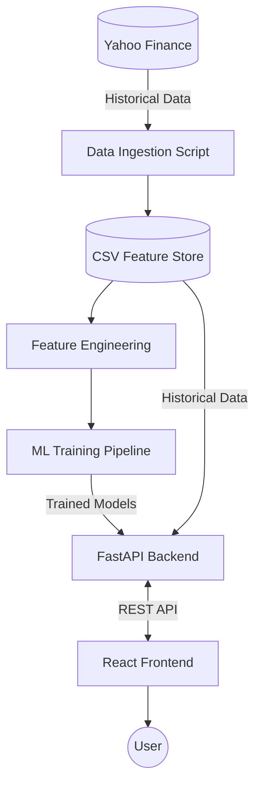

# 1. HERO SECTION

# MarketPulse AI

An end-to-end AI-driven NSE sectoral index analysis, forecasting, and health classification dashboard.

`Python` `FastAPI` `React` `Vite` `scikit-learn` `Machine Learning`

* **GitHub Repository**: [Ashu4495/AI-Based-Sector-Performance-Analysis](https://github.com/Ashu4495/AI-Based-Sector-Performance-Analysis)

---

# 2. PROJECT OVERVIEW

MarketPulse AI is a comprehensive data pipeline, machine learning engine, and modern web dashboard designed to analyze and predict the performance of key sectors within the National Stock Exchange of India (NSE). It evaluates the "health" of sectors (e.g., IT, Banking, Pharma) using classification models and forecasts their short-term returns using regression models, providing transparent explainability through SHAP (SHapley Additive exPlanations).

This tool is designed for retail investors, quantitative analysts, and financial researchers who want data-driven, explainable insights into sector rotation rather than relying purely on intuition.

---

# 3. PROBLEM STATEMENT

Retail investors and traders often struggle to identify which market sectors are currently strong, weak, or about to rotate. Existing solutions typically provide raw technical charts without actionable, synthesized insights. Furthermore, many modern AI-driven financial tools act as "black boxes" where predictions are given without explaining *why* a sector is deemed bullish or bearish. This lack of transparency makes it difficult for users to trust and act upon the predictions.

---

# 4. SOLUTION

MarketPulse AI solves this by ingesting daily historical data for 8 major NSE sectors and engineering a robust set of technical features (RSI, MACD, Moving Averages, Volatility). It applies a `RandomForestClassifier` to map current technical conditions into discrete health labels (e.g., "Strong Buy", "Neutral", "Strong Avoid") and uses a `Ridge Regression` model to forecast 5-day directional returns. 

Crucially, the solution integrates TreeSHAP to decode the model's logic, showing users exactly which technical indicators drove the current health classification. All of this is served via a high-performance FastAPI backend to a sleek, analyst-style React dashboard.

---

# 5. KEY FEATURES

* ✅ **Daily Data Ingestion**: Automated fetch pipelines utilizing `yfinance` for NSE sectors and the NIFTY 50 benchmark.
* ✅ **Sector Health Classification**: Classifies sectors into 5 discrete health buckets using Random Forest.
* ✅ **Short-Term Forecasting**: Predicts 5-day sector returns using Ridge Regression.
* ✅ **Model Explainability**: Explains the top feature drivers (e.g., RSI, Volatility) for every prediction using SHAP.
* ✅ **Strategy Backtesting**: Simulates a monthly sector-rotation strategy and benchmarks it against the NIFTY 50 index.
* ✅ **Interactive Dashboard**: Modern React UI featuring dynamic ticker strips, historical price charts with indicator overlays, and light/dark "trading desk" themes.

---

# 7. SYSTEM ARCHITECTURE



---

# 8. WORKFLOW

1. The data pipeline fetches historical OHLCV data for 8 NSE sectors from Yahoo Finance.
2. The feature engineering module calculates technical indicators (EMA, SMA, RSI, MACD) and relative performance metrics.
3. The Machine Learning models are trained offline on the historical features.
4. The user opens the React dashboard.
5. The frontend requests the latest sector leaderboard and forecasts from the FastAPI backend.
6. The backend loads the pre-trained ML models, scores the latest data, and calculates SHAP values.
7. The results, including predictions and top feature drivers, are returned as JSON and rendered on the UI.

---

# 9. TECHNOLOGY STACK

| Category       | Technology |
| -------------- | ---------- |
| Frontend       | React, Vite, Tailwind CSS, Recharts, Lucide React |
| Backend        | Python, FastAPI, Uvicorn, Pydantic |
| Database       | File-based CSV & JSON Storage |
| AI/ML          | scikit-learn, SHAP, Pandas, NumPy, pandas-ta |
| APIs           | RESTful API |
| Authentication | `Not implemented` |
| Deployment     | Render (Backend), Vercel/Netlify (Frontend) |
| Tools          | Git, pytest |

---

# 10. AI / MACHINE LEARNING SECTION

### Dataset
* **Source**: Yahoo Finance (`yfinance`)
* **Assets**: 8 major NSE sector indices (e.g., NIFTY IT, NIFTY BANK) and NIFTY 50 benchmark.
* **Features**: 22 engineered technical features (e.g., `rsi_14`, `macd`, `volatility_20d`, `price_to_ema20`, `ratio_to_benchmark`).
* **Target Variables**: 
  - Classification: Discrete health labels (Avoid, Buy, Neutral, Strong Avoid, Strong Buy).
  - Regression: 5-day continuous return.

### Preprocessing
* Missing value forward-filling and interpolation.
* Technical indicator computation using `pandas-ta`.
* Scaling applied as required by the Ridge Regression pipeline.

### Model 1: Health Classifier
* **Algorithm**: `RandomForestClassifier`
* **Hyperparameters**: `n_estimators=150`, `max_depth=6`, `min_samples_leaf=10`, `class_weight='balanced'`

| Metric    |        Score |
| --------- | -----------: |
| Accuracy  | 44.33% |
| F1 Score (Weighted) | 44.68% |

*(Note: In the context of predicting volatile 5-class financial market directions, a 44% accuracy significantly outperforms the 20% random baseline).*

### Model 2: Return Forecaster
* **Algorithm**: `Ridge Regression`
* **Hyperparameters**: `alpha=10.0`

| Metric    |        Score |
| --------- | -----------: |
| Mean Absolute Error (MAE) | 0.0244 (2.44%) |
| Directional Accuracy | 54.77% |

---

# 12. PROJECT STRUCTURE

```text
AI-Based-Sector-Performance-Analysis/
│
├── backend/
│   ├── app/
│   │   ├── api/             # FastAPI REST endpoints
│   │   ├── backtest/        # Sector rotation strategy simulator
│   │   ├── core/            # Configuration and logging
│   │   ├── data/            # Data fetching and storage
│   │   ├── features/        # Technical indicator engineering
│   │   ├── models/          # ML training, prediction, and SHAP logic
│   │   ├── schemas/         # Pydantic response models
│   │   └── main.py          # FastAPI application entry point
│   ├── tests/               # Pytest suite
│   └── requirements.txt     # Duplicate requirements (removed in cleanup)
│
├── frontend/
│   ├── public/              # Static assets (logos, icons)
│   ├── src/
│   │   ├── api/             # API client wrapper
│   │   ├── components/      # Reusable React components (Charts, Navbar)
│   │   ├── context/         # Theme context
│   │   ├── pages/           # Application views (Dashboard, SectorDetail)
│   │   ├── styles/          # CSS and Tailwind tokens
│   │   ├── App.jsx          # Main React router/state wrapper
│   │   └── main.jsx         # React entry point
│   ├── package.json         # Frontend dependencies
│   └── vite.config.js       # Vite bundler config
│
├── .gitignore
├── Procfile                 # Deployment configuration for Render/Heroku
├── README.md
├── pytest.ini
├── requirements.txt         # Root Python dependencies
└── runtime.txt              # Python runtime specification
```

---

# 13. REQUIREMENTS

* Python 3.11.x
* Node.js 18+ and `npm`
* Internet connection (for `yfinance` data fetching)

---

# 14. INSTALLATION

### Clone repository

```bash
git clone https://github.com/Ashu4495/AI-Based-Sector-Performance-Analysis.git
cd AI-Based-Sector-Performance-Analysis
```

### Install Backend Dependencies (Python)

```bash
python -m venv .venv
# On Windows:
.venv\Scripts\activate
# On Mac/Linux:
source .venv/bin/activate

pip install -r requirements.txt
```

### Install Frontend Dependencies (Node.js)

```bash
cd frontend
npm install
```

---

# 15. ENVIRONMENT VARIABLES

`Optional`

If you are running the frontend entirely separate from the backend (e.g., in a production deployment like Vercel), you must provide the backend API URL to the frontend environment.

Create a `.env` file in the `frontend/` directory:

```env
VITE_API_URL=https://your-production-backend-url.com
```

---

# 16. RUNNING THE PROJECT

### Development

To run the Backend:
```bash
# From the root directory (ensure venv is activated)
uvicorn backend.app.main:app --port 8000 --reload
```

To run the Frontend:
```bash
# Open a new terminal, navigate to the frontend directory
cd frontend
npm run dev
```

### Data Pipeline & Model Retraining (Optional)
If you wish to fetch the absolute latest data and retrain the models locally:
```bash
# From the root directory:
python -m backend.app.data.clean
python -m backend.app.features.engineer
python -m backend.app.models.train_forecast
python -m backend.app.models.train_classifier
python -m backend.app.backtest.rotation_strategy
```

---

# 17. USAGE

1. Start both the backend and frontend servers.
2. Open your browser to the local Vite URL (usually `http://localhost:5173`).
3. View the **Landing Page** to see the overall market pulse.
4. Click "Explore Dashboard" to view the **Leaderboard**, which ranks sectors by their ML-predicted health label and momentum.
5. Click on any specific sector (e.g., "NIFTY IT") to view the **Sector Detail** page.
6. Analyze the SHAP feature drivers panel to understand *why* the AI assigned a specific health label based on current technical indicators.
7. Switch between Light and Dark mode using the toggle in the navigation bar.


---

*🚀 MarketPulse AI — Turning market data into actionable intelligence.* ✨
